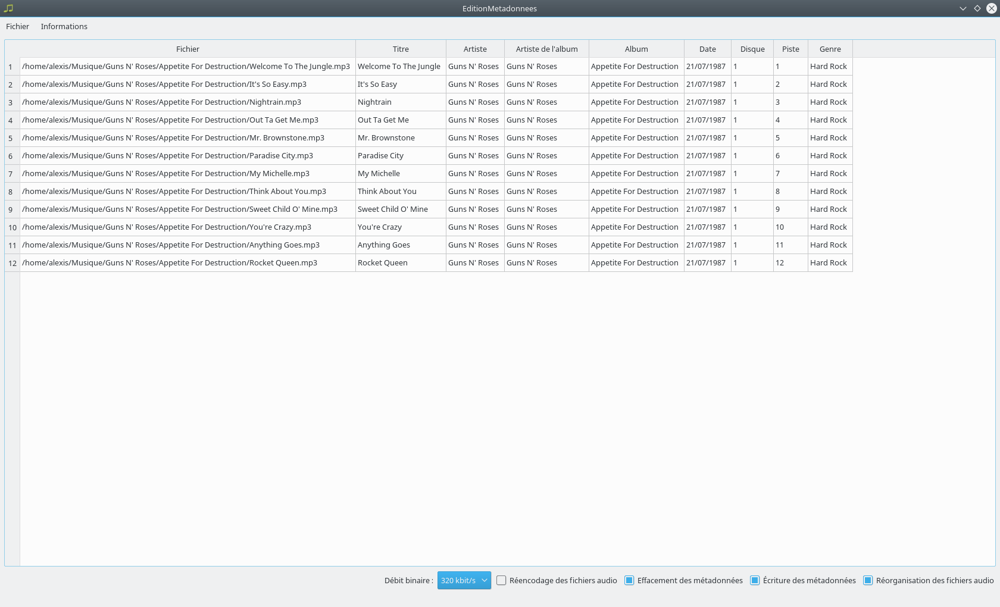

# EditionMetadonnees

EditionMetadonnees est une application graphique permettant l'édition et l'application de métadonnées.

Les fonctionnalités principales de l'application sont les suivantes :

 - Sélection d'un répertoire contenant des fichiers audio,
 - Édition graphique des métadonnées des fichiers audio,
 - Réencodage des fichiers audio, effacement des métadonnées, écriture des métadonnées et réorganisation des fichiers audio,
 - Chargement et sauvegarde d'une édition de métadonnées.

L'application est réalisée en C++11 et Qt 4.8.7 et nécessite l'application FFmpeg 3.2.12.

